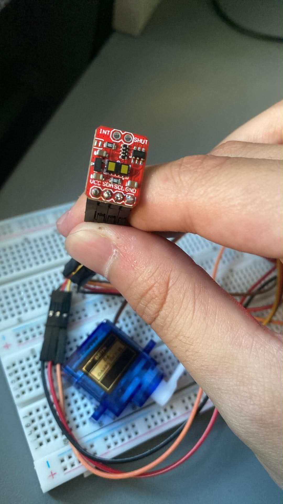

# Radar Project

This project is a radar-like scanning object detection system developed using an ESP32 microcontroller, a laser time-of-flight distance sensor, and an SG90 micro servo motor. The system performs angular scanning, measures object distance, and sends the acquired data to a MATLAB application for real-time visualization and signal processing.

Although the system is not a classical radio-frequency radar, it reproduces a radar-like scanning behavior by combining angle and distance measurements to generate a spatial representation of detected objects.

## Project Overview

The main purpose of this project is to build a compact embedded sensing system capable of:

* scanning the environment through servo-based angular motion,
* measuring object distance using a laser time-of-flight sensor,
* visualizing detected objects in a radar-like interface,
* displaying distance variation over time,
* applying basic signal processing methods to the measured signal.

The project combines embedded systems, serial communication, data visualization, and signal processing in one practical engineering application.

## Features

* Real-time distance measurement using a laser ToF sensor
* Servo-based angular scanning
* Live radar-style spatial mapping
* Raw and filtered distance plotting
* FFT-based spectrum analysis of the measured distance signal
* Live servo angle visualization
* Serial communication between ESP32 and MATLAB
* MATLAB App interface with multiple visualization modes

## Hardware Components

The prototype is built using the following hardware:

* **ESP32 development board**
  Used as the main control unit for sensor communication, servo control, and serial data transmission.

* **Laser time-of-flight distance sensor**
  Used to measure the distance between the system and detected objects.

* **SG90 micro servo motor**
  Used to rotate the sensor and provide angular scanning.

* **Breadboard and jumper wires**
  Used for rapid prototyping and hardware connections.

* **USB connection**
  Used for power supply and serial communication with the computer.

## Hardware Images

### ESP32 Development Board


### SG90 Micro Servo Motor


### VL53L1X Distance Sensor



### Prototype Setup


## Software Components

The software side of the project consists of:

* **ESP32 firmware**

  * reads distance data from the sensor,
  * controls servo position,
  * sends angle and distance data through serial communication.

* **MATLAB App Designer application**

  * receives incoming serial data,
  * stores angle, distance, and time values,
  * updates real-time visualization plots,
  * filters the measured distance signal,
  * computes FFT-based spectral analysis,
  * displays the servo angle over time.

## MATLAB App Functions

The MATLAB App includes three main visualization modes.

### 1. Radar View

This mode displays the detected object positions in a radar-like map. The measured angle and distance values are converted from polar coordinates into Cartesian coordinates to generate a two-dimensional spatial representation.

### 2. Distance View

This mode displays:

* the raw distance signal,
* the filtered distance signal,
* the FFT spectrum of the first 10 seconds of the measured signal.

This is the main view used for signal processing and interpretation.

### 3. Angle View

This mode displays the servo angle as a function of time, allowing the scanning motion to be monitored and verified.


## Signal Processing Implementation

The most important part of this project is the signal processing stage applied to the measured distance signal.

### Measured Signal

The main processed signal is **distance over time**. The sensor provides distance values, and MATLAB assigns timestamps to each received sample.

### Moving Average Filtering

The application applies a **moving average filter** to smooth the raw distance signal. This reduces short-term fluctuations and measurement noise.

In the current implementation, the moving average uses a 5-sample window. This behaves as a simple **low-pass filter**, suppressing rapid variations while preserving the slower trend of the signal.

### DC Offset Removal

Before frequency analysis, the mean value of the selected distance signal is subtracted. This removes the **DC offset**, which corresponds to the average distance level of the object.

This step ensures that the FFT focuses on variations in the signal rather than its constant average value.

### Sampling Frequency Estimation

Since the signal is acquired in real time through serial communication, the sampling interval is not perfectly constant. Therefore, the MATLAB application estimates the sampling frequency from the recorded timestamps using the average time difference between consecutive samples.

### Fast Fourier Transform (FFT)

The application computes the **Fast Fourier Transform** of the first 10 seconds of the distance signal. The FFT is used to analyze the frequency content of the measured motion and identify dominant periodic components.

The one-sided magnitude spectrum is displayed in the MATLAB interface for interpretation.

## Result Graphs

### Averaged Distance and FFT Spectrum


## Project Structure

```text
Radar-Project/
├── esp32_code/          # ESP32 firmware
├── matlab_app/          # MATLAB App Designer files
├── images/
│   ├── components/      # Hardware photos
│   ├── app/             # MATLAB app screenshots
│   └── results/         # Graphs and result images
├── docs/                # Article drafts and documentation
└── README.md            # Main project overview
```

## Current Status

The project currently demonstrates:

* successful hardware integration,
* real-time distance acquisition,
* servo-based scanning,
* radar-like object mapping,
* filtered distance visualization,
* FFT-based signal analysis in MATLAB.

At the current stage, the system focuses on acquisition, visualization, and signal interpretation. Direct velocity and acceleration estimation are planned as future improvements.

## Future Improvements

Possible future developments include:

* velocity estimation from distance-time data,
* acceleration estimation,
* more advanced digital filtering methods,
* improved mechanical mounting for the sensor,
* PCB-based hardware implementation,
* improved sampling consistency,
* automatic object tracking,
* extended MATLAB interface features,
* data logging and export functions.

## Documentation

Additional project documentation can be found in:

* `docs/` — article drafts and written project materials
* `esp32_code/` — embedded firmware description
* `matlab_app/` — MATLAB App documentation
* `images/` — hardware images, screenshots, and result graphs

## Project Goal

The goal of this project is to create a compact measurement and visualization system that combines embedded sensing, scanning, and signal processing in a practical engineering application.

This project also serves as a foundation for future work in motion analysis, intelligent sensing, and real-time object tracking.

## Author

Developed by **Ali Sarp Aksoy**.
